# AsProgrammer dregmod

Read, write and verify SPI, I2C and Microwire flash chips from Windows.
Supports **Buzzpirat, Bus Pirate v3.x, Bus Pirate v5/v6/v7**, CH341a, CH347,
UsbAsp, AVRISP (LUFA), Arduino and FT232H.

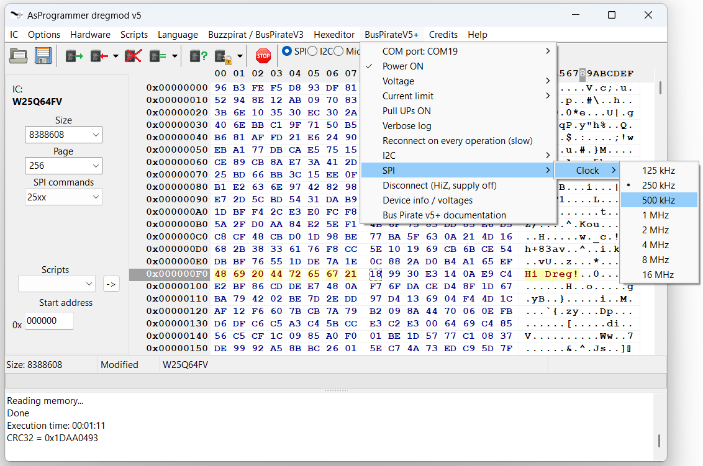

**[Download the latest release](https://github.com/therealdreg/asprogrammer-dregmod/releases/latest)**

---

# Before you start

- **Use a short, good quality USB cable, straight into the PC.** USB hubs and
  virtual machines cause problems.
- **Watch the progress bar at the bottom.** It moves while the operation runs,
  and the log pane under it records the start and the result. A big chip at a
  low clock takes a long time, so give it a while before deciding it has hung.
  **Cancel** stays live the whole time.
- **Use the shortest dupont wires you can, 10 cm or less.** This is the single
  biggest cause of bad reads. These are unshielded, unterminated wires carrying a
  clock of several MHz next to each other, and every extra centimetre makes it
  worse. 30 cm jumpers work but leave you no margin. Clip adapters and
  breadboards add length too, so count them in.
- **Long wires and low voltages both push you towards a slower clock.** When a
  read misbehaves, the clock is the first thing to lower, not the last.
- **When something is stuck, reconnect and restart before anything else.**
  Unplug the Bus Pirate from USB, plug it back in, then close the program and
  open it again. Do both: the replug clears whatever state the device is in, and
  restarting drops a serial port the program may still be holding. It costs
  fifteen seconds and it is the fix far more often than anything you would guess
  at instead. It is also worth doing before reporting a problem, because a fault
  that does not survive it was the bench.
- **Do not touch anything while it is working. Anything.** Not the dupont
  wires, not the clip, not the USB cable, not the Bus Pirate itself, not the
  desk it is all sitting on. Writing a large chip can take half an hour and it
  is tempting to tidy up while you wait. A nudge you would not even notice comes
  back as a transfer that stops halfway, a dump that is short, or two reads of
  the same chip that disagree, and every one of those looks exactly like a bug
  in the software. If it happens, reconnect and run it again before concluding
  anything: a fault that does not survive a second attempt was the bench.
- **Get the physical connection right before you blame anything else.** Push the
  clip fully home and check it is on the right way round. Tug each dupont wire
  gently at both ends: the crimp inside the plastic shell is the usual culprit
  and it fails without looking any different. Cheap jumper wires are worth
  replacing rather than debugging. See
  [When the wiring is the problem](#when-the-wiring-is-the-problem), which is
  where nearly every reproducible fault on a bench ends up.
- **Settings we use in our hardware hacking bootcamps**
  (https://hardwarehacking.es), and a safe place to start if you are not sure:

  | setting | value |
  | --- | --- |
  | SPI clock at 3.3 V or 5 V | 125 kHz |
  | SPI clock at 1.8 V | 30 kHz |
  | I2C clock | 50 kHz |
  | Serial link speed, Bus Pirate v3.x | 115200 baud |

  The table is what just works in a room full of different chips, wires and
  adapters, which is why it is what we teach with. Get a clean read first, then
  raise the clock if you care about the speed: the program will go up to 8 MHz
  on a Bus Pirate v3, 16 MHz on a v5 or newer, and 2 Mbaud on the v3 serial
  link. The 30 kHz row is a Bus Pirate v3 setting. A v5 or newer starts its SPI
  list at 125 kHz, so for a 1.8 V part there use that and keep the wires very
  short.
- **Wire the chip up before you press anything.** The on board supply is armed
  from the moment the program starts, because **Power ON** is ticked by default.
  It is not live yet: it comes up the first time the program opens the device,
  which is the first time you press a toolbar button, open **Device info /
  voltages**, or run **Scan the I2C bus**. Any of those three energises your
  chip. So finish the wiring first, and on a Bus Pirate v5 or newer set the
  **Voltage** before you touch anything, because it starts at 3.3 V and a 1.8 V
  part will not survive that. Unticking **Power ON** afterwards does not switch
  a live supply back off, so it is not an undo: use **Disconnect**.

---

# Worked example: reading a 3.3 V SPI flash with a Bus Pirate v6

> **Before anything else, put the latest firmware on the Bus Pirate.** New
> builds appear constantly and the binary interface this program speaks is
> part of what is being worked on, so an old one is the most common cause of
> trouble. See
> [Firmware: update it, and keep updating it](#firmware-update-it-and-keep-updating-it).

Start to finish on a real part, an SST25VF080B on a breakout board. The same
steps work for any 25 series SPI flash.

The order matters. The Bus Pirate is put into SPI mode from its own terminal
first, not because AsProgrammer needs it, but because that is what makes the
device label its own pins on screen. Wire the chip up against those labels, and
only then switch it to the binary mode AsProgrammer speaks.

## 1. Open the Bus Pirate terminal

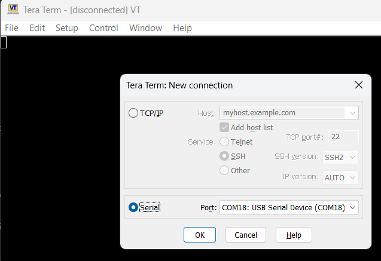

Any terminal program will do. A Bus Pirate v5 or newer shows up as two serial
ports, and this is the first of the pair, the one that talks to a human. Here it
is COM18, described by Windows as a USB Serial Device. The baud rate does not
matter.

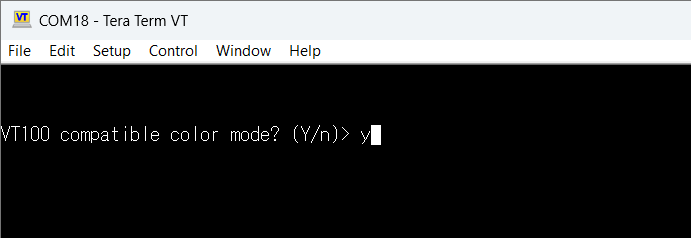

**The window opens black and empty. Press Enter.** That is what makes the device
ask **VT100 compatible color mode? (Y/n)**. Type **y**, press Enter again, and
you are at the Bus Pirate console with its `HiZ>` prompt.

Do not skip this. Until the question is answered the device ignores everything
you type, and a terminal that sits there black is a common way to conclude that
a perfectly healthy Bus Pirate is dead.

## 2. Put it in SPI mode so it labels its pins

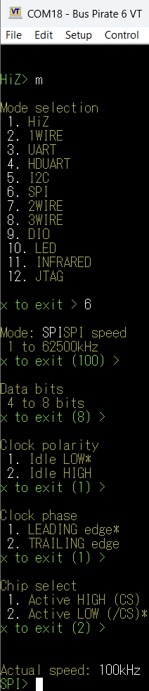

Type `m` for the mode menu and choose **6. SPI**. Then press Enter through the
questions to take the defaults: 100 kHz, 8 data bits, clock idle LOW, sample on
the LEADING edge, chip select active LOW. Those are what an ordinary 25 series
flash expects. The prompt changes to `SPI>`.

## 3. Read the pinout off the screen and wire it up

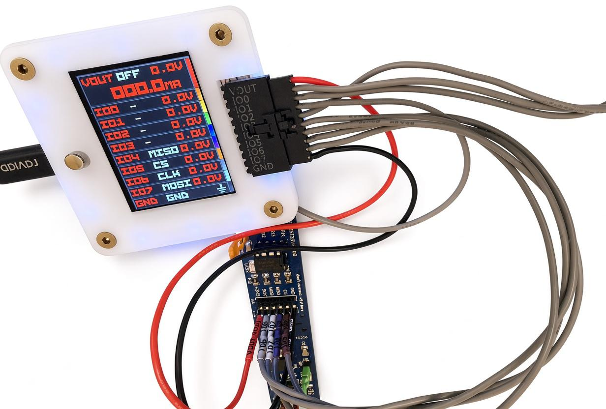

Now the device's own display tells you where everything goes: **IO4 is MISO,
IO5 is CS, IO6 is CLK, IO7 is MOSI**, plus VOUT and GND. The top line reads
`VOUT OFF 0.0V`, which is exactly what you want while you are still connecting
things.

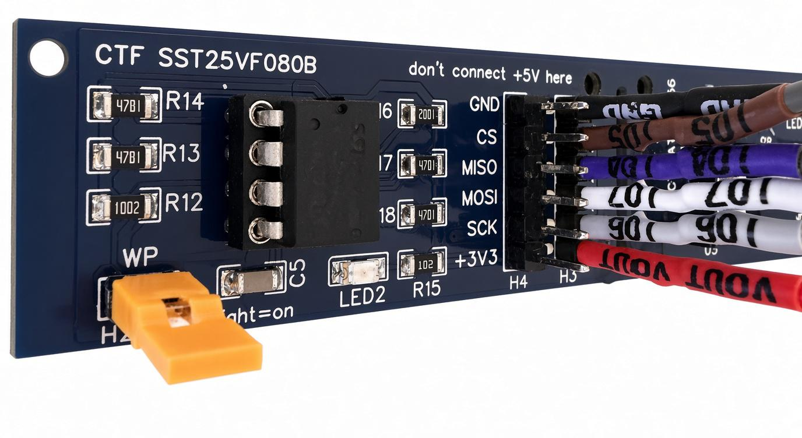

The target header is labelled on the board: GND, CS, MISO, MOSI, SCK, +3V3.
Match them to the Bus Pirate pins, and note the two warnings printed on the
board itself. It says **don't connect +5V here**, so the supply has to be 3.3 V,
and the yellow jumper near **WP** is the write protect link. It is fitted in
this photo, which is what you want if you intend to write the chip later.

Wire it with the supply off, and check every connection before you power
anything. See [When the wiring is the problem](#when-the-wiring-is-the-problem)
if anything misbehaves afterwards.

## 4. Switch the device to BPIO2

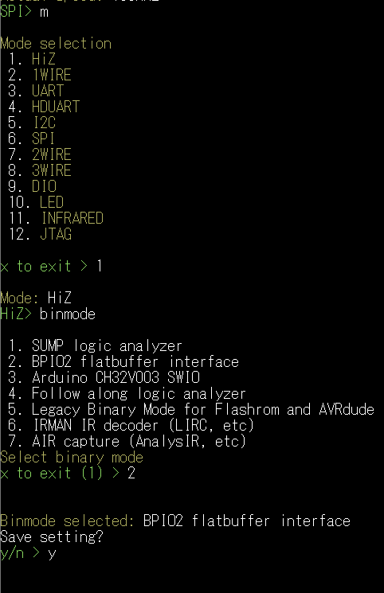

Back at the terminal, `m` then **1. HiZ** to leave SPI mode, then type `binmode`
and choose **2. BPIO2 flatbuffer interface**. Answer **y** to `Save setting?` or
it is forgotten the next time the device restarts.

This is the step AsProgrammer cannot do for you. Out of the box the device is a
SUMP logic analyzer, which answers on the same port and will not speak BPIO2.

## 5. Select the programmer

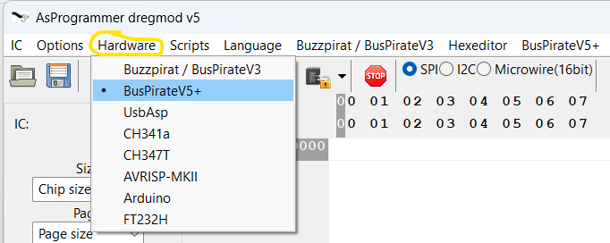

**Hardware -> BusPirateV5+**.

## 6. Select the SPI bus

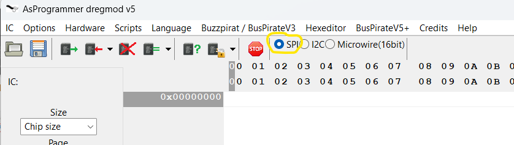

Pick **SPI** with the radio buttons. Do this before choosing the chip, because
changing the bus clears the chip size and page size.

## 7. Pick the right COM port

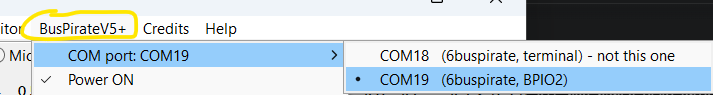

**BusPirateV5+ -> COM port**. The program labels the pair for you: COM18 is the
terminal, marked *not this one*, and **COM19 carries BPIO2**. That is the one to
select. This is the second port of the pair, not the one the terminal used in
step 1.

## 8. Set the bus clock

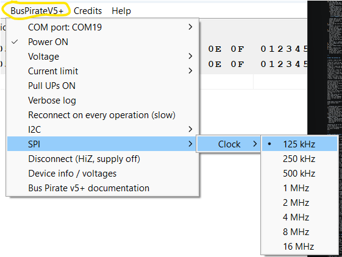

**BusPirateV5+ -> SPI -> Clock -> 125 kHz**. Start slow. It reads a 1 Mbit chip
in well under two minutes and it works on wiring that faster clocks do not. Once
you have two identical reads you can raise it.

## 9. Set the supply voltage

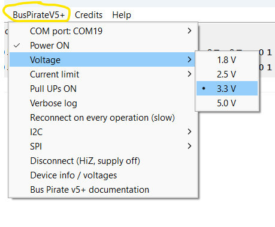

**Voltage -> 3.3 V**, because that is what this part wants and what its board
says. Get this right before the supply comes up: a 1.8 V part on 3.3 V does not
survive it.

## 10. Set the current limit

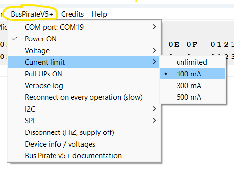

**Current limit -> 100 mA**. A flash chip of this size draws a few milliamps, so
100 mA is generous while still cutting off quickly if something is shorted.

## 11. Check Power ON

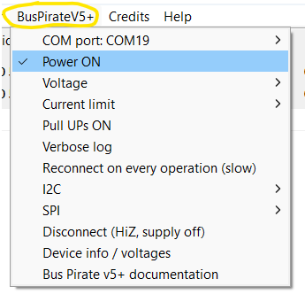

**Power ON** is ticked by default. The rails do not actually come up until the
program opens the device, which is when you press your first button, so make
sure everything is wired before you go on.

## 12. Identify the chip

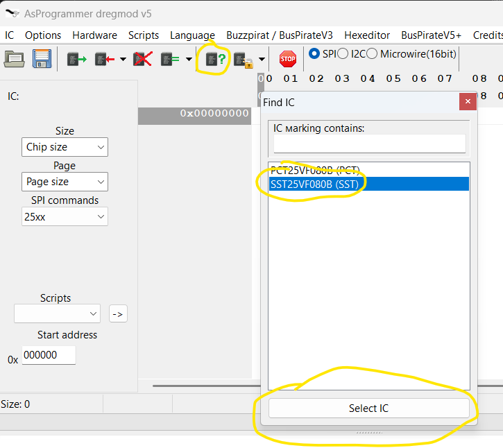

Press **Read ID**. The **Find IC** window opens with the parts that match the
identifier the chip returned. Two entries share this one, `PCT25VF080B (PCT)`
and `SST25VF080B (SST)`, so pick the one that matches the marking on your chip
and press **Select IC**. Nothing is chosen until you do: closing the window
leaves the program with no chip selected.

## 13. Read the chip

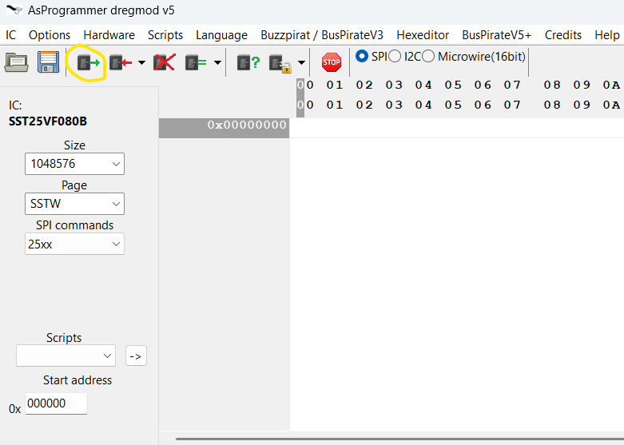

The panel now shows what the chip list knows: **SST25VF080B, size 1048576, page
SSTW**. `SSTW` is not a page size, it is a marker saying this family is written
two bytes at a time rather than by pages. It makes no difference to reading, but
it makes writing much slower. Press **Read IC**.

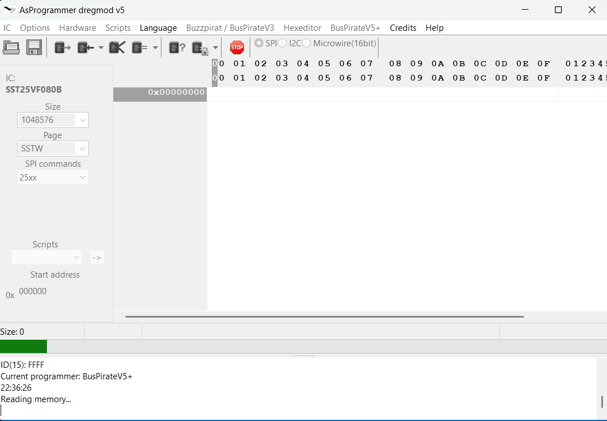

The progress bar at the bottom moves while it works and the log records what is
happening.

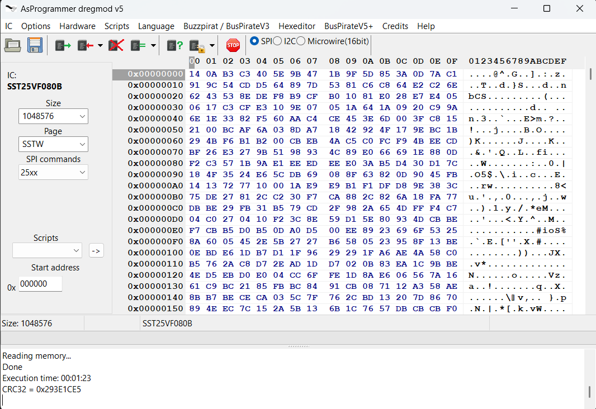

Done. The whole megabyte is in the hex editor, and the log gives the elapsed
time and a CRC32 of what was read, which is a quick way to compare two reads
without saving both. **Press Save file to keep it.** Reading only fills the
editor, nothing reaches your disk until you do.

Then read it a second time and check the CRC32 matches. Two reads that agree are
the cheapest proof you have that the wiring held, and it is worth doing before
you trust the dump or write anything back.

---

# Worked example: reading an I2C EEPROM with a Bus Pirate v6

> **Before anything else, put the latest firmware on the Bus Pirate.** New
> builds appear constantly and the binary interface this program speaks is
> part of what is being worked on, so an old one is the most common cause of
> trouble. See
> [Firmware: update it, and keep updating it](#firmware-update-it-and-keep-updating-it).

The same walkthrough for an I2C part, an AT24C256 on a breakout board. It
follows the SPI example above, so this one concentrates on what is different:
the device address, the pull ups, and the bus scanner.

## 1. Open the Bus Pirate terminal


The first port of the pair, the one that talks to a human. COM18 here.


**The window opens black and empty. Press Enter** to make the device ask
**VT100 compatible color mode? (Y/n)**, type **y**, and press Enter again. Now
you are at the Bus Pirate console. Until that question is answered the device
ignores anything you type.

## 2. Put it in I2C mode so it labels its pins

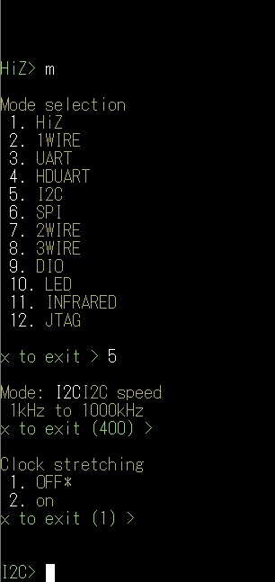

Type `m` and choose **5. I2C**. Take the defaults with Enter: 400 kHz and clock
stretching off. The prompt becomes `I2C>`, and the device display now names its
own pins so you can wire the EEPROM against them.

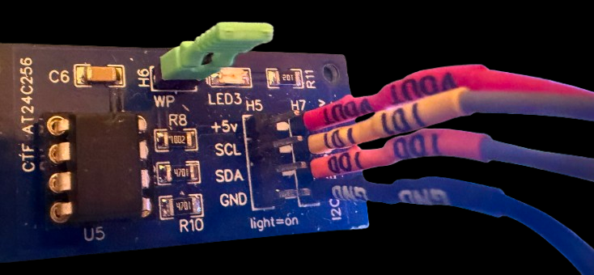

Only four wires, and the board labels every one of them. Reading down the
header:

| board pin | Bus Pirate pin |
| --- | --- |
| +5v | VOUT, the on board supply |
| SCL | IO1, the clock |
| SDA | IO0, the data line |
| GND | GND |

I2C needs only two signals, a clock and a data line, which is why this is so
much simpler than the six wires the SPI example needed. Note the green jumper
fitted at **H6**, next to **WP**: that is the write protect link, and the EEPROM
will refuse to be written without it.

The pin is silkscreened `+5v`, but this part runs anywhere from 1.8 V to 5.5 V,
and the screenshots below use 3.3 V. Match the voltage to your own chip's
datasheet rather than to the label.

Wire it up with the supply off, then come back.

## 3. Switch the device to BPIO2

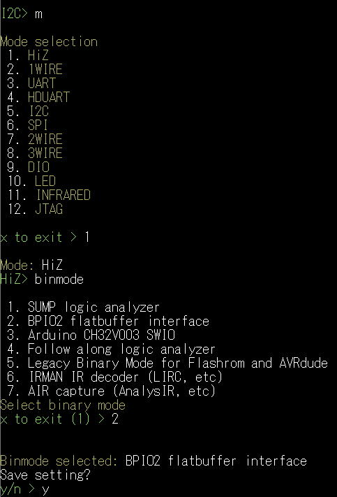

`m` then **1. HiZ** to leave I2C mode, then `binmode` and **2. BPIO2 flatbuffer
interface**. Answer **y** to `Save setting?`.

## 4. Select the programmer


**Hardware -> BusPirateV5+**. Then pick the BPIO2 port under
*BusPirateV5+ -> COM port*, which is the second of the pair and the one the menu
labels **BPIO2**, not the terminal port you used in step 1.

## 5. Select the I2C bus

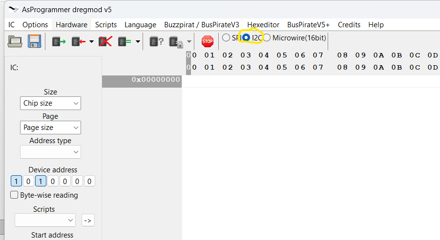

Choose **I2C**. A row of toggles appears reading **1 0 1 0 0 0 0**, which is the
chip's 7 bit address, 0x50. That is the default for a 24 series EEPROM with its
A0, A1 and A2 pins tied to ground, and it is what the scan in step 8 will
confirm.

## 6. Set the supply and the current limit


**Power ON** is already ticked. Set **Current limit** and **Voltage** to suit the
part. The rails do not come up until the program opens the device, so finish the
wiring first.

**No pull ups needed here.** The breakout board already has them, which is why
**Pull UPs ON** is left unticked in these screenshots. I2C needs pull up
resistors on SDA and SCL to work at all, and if your board does not carry them
you have to tick that option. A bus with no pull ups at all is the most common
reason a scan finds nothing.

## 7. Set the bus clock

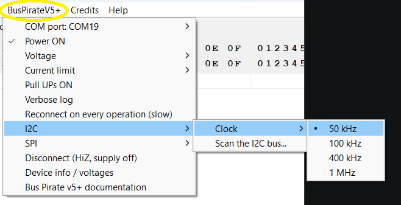

**BusPirateV5+ -> I2C -> Clock -> 50 kHz**. An EEPROM this size reads in seconds
even at the slowest setting, so there is nothing to gain by starting fast.

## 8. Scan the bus

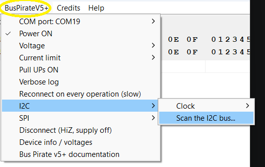

**I2C -> Scan the I2C bus...**. Worth doing before anything else: it tells you
what is really out there rather than what you assumed.

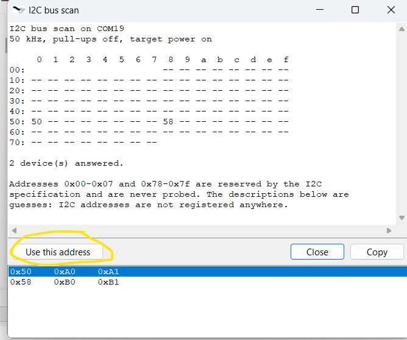

The window reports the conditions it scanned under, **50 kHz, pull-ups off,
target power on**, then an `i2cdetect` style map. Two addresses answered here:

- **0x50** is the EEPROM itself. The list at the bottom shows its write and read
  addresses, 0xA0 and 0xA1, which are the 7 bit address shifted up with the
  read/write bit added.
- **0x58** is a second address the same package answers on, a small read only
  identification area that some 24 series parts carry. It is not your data.

Select the row you want and press **Use this address** to copy it into the
toggles. If nothing answers at all, check the pull ups and the wiring before
anything else.

## 9. Choose the chip

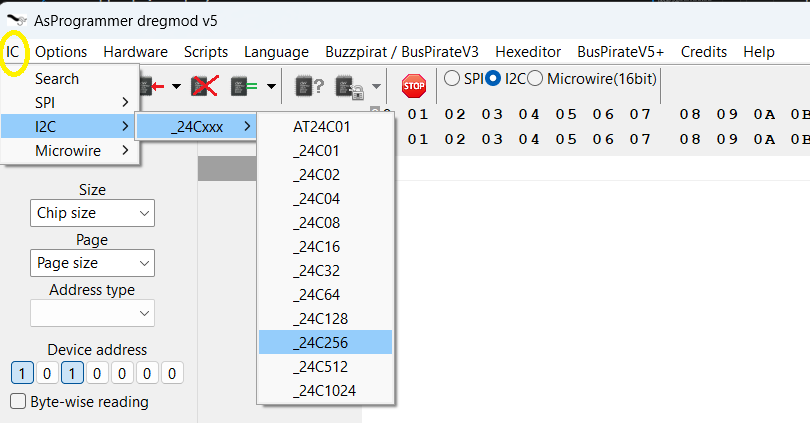

**IC -> I2C -> _24Cxxx -> _24C256**. There is no Read ID on I2C: an EEPROM has
no JEDEC identifier to give, so you have to tell the program what it is. Pick
the entry that matches the marking on your part, because the size and the
addressing width come from that choice and nothing cross checks them.

## 10. Read it

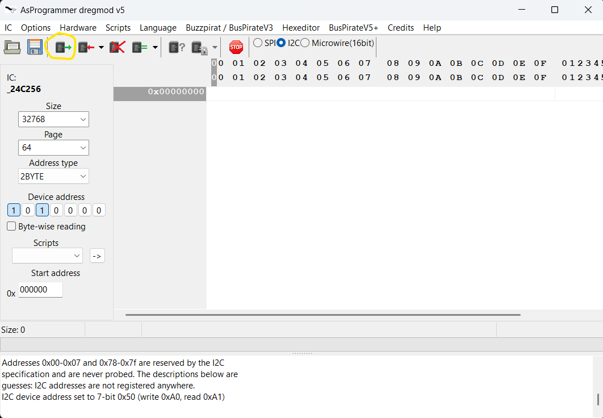

The panel fills in from the chip list: **size 32768, page 64, address type
2BYTE**. That last one matters, because EEPROMs above 2 Kbit need two address
bytes and smaller ones need one, and getting it wrong reads the wrong place. The
log confirms the address in use: *I2C device address set to 7-bit 0x50 (write
0xA0, read 0xA1)*. Press **Read IC**.

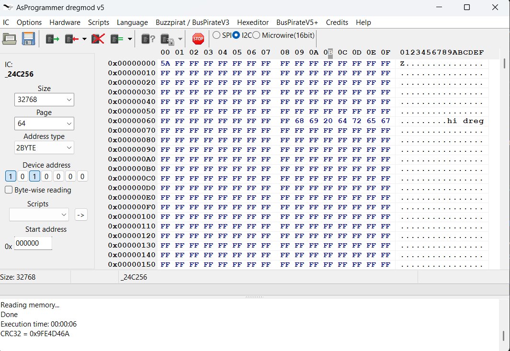

Done in six seconds. The chip is mostly erased, `FF` everywhere, with a short
string written into it earlier, visible as **hi dreg** in the text column at
0x68. The log gives the elapsed time and a CRC32.

**Press Save file to keep it.** Then read it again and check the CRC32 matches,
which is the cheapest proof that the wiring held.

---

# The shape of every job

The two examples above are Bus Pirate v6 specific. Whatever the programmer, the
job is always the same shape:

1. **Hardware** menu, pick your programmer. A fresh install starts on
   *Buzzpirat / BusPirateV3*.
2. Pick the **COM port** in that programmer's own menu. The list only shows
   ports that exist right now.
3. Set the supply and the clock. Start slow: 125 kHz for SPI, 50 kHz for I2C.
   On a Bus Pirate v3 there is no voltage setting, the board gives fixed 3.3 V
   and 5 V pins, and a 1.8 V part needs an external supply, see the
   [1.8 V example](#spi-flash-winbond-w25q64fw-at-18-v).
4. Choose the bus with the radio buttons, then the chip. **Read ID** finds it
   for you on SPI; on I2C there is no id to read, so pick it from the **IC**
   menu.
5. **Read IC**, then **Save file**. Reading only fills the hex editor.
6. **Read IC** again and check you get the same thing. Two reads that agree are
   what tells you the wiring is trustworthy, and you want that before you write
   anything.

**Read a chip before you ever write one.** It proves the wiring and it leaves
you a backup to put back if a write goes wrong.

---

# What the buttons do

| button | what it does | changes the chip |
| --- | --- | --- |
| Read ID | asks an SPI flash for its JEDEC id and offers the parts that match. SPI only, an I2C EEPROM has no id to give | no |
| Read IC | reads the whole chip into the hex editor | no |
| Program IC | writes what is in the hex editor to the chip | yes |
| Verify IC | reads the chip back and compares it against the hex editor | no |
| Erase IC | erases the chip back to all 0xFF | yes |
| Unprotect | clears the write protection bits in the status register | yes |
| Open file / Save file | load or save the hex editor content, nothing is sent to the chip | no |
| Cancel | stops the operation that is running | no |

**Program IC does not erase for you on an SPI flash, and it does not check its
own work either.** Writing can only turn 1 bits into 0 bits, so programming on
top of data that is already there leaves you with the old and the new ANDed
together. Worse, the write back check, *Options -> Verify*, is off until you
turn it on, so that write finishes and reports Done with nothing wrong in the
log. The
habit that saves you is **Erase IC**, then **Program IC**, then **Verify IC**,
every time. I2C EEPROMs are different and overwrite in place, so they need no
erase.

**The small arrow next to a button holds more commands.** Three buttons have
one:

- **Program IC** holds a combined command. It asks once, *IC will be erased and
  programmed. Continue?*, and then runs unprotect, erase, program and verify
  straight through with no further prompts.
- **Verify IC** holds **Blank check**, which compares the whole chip against all
  0xFF. It is the quickest way to prove an erase really took.
- **Unprotect** holds **Set the protection bits**, **Read SREG** and **Edit
  SREG**. *Set the protection bits* writes the status register immediately and
  asks nothing, so it is the one not to press while you are exploring.

**Nothing you do in the hex editor touches the chip.** Open a file, edit it,
fill it with random data, none of it reaches the chip until you press **Program
IC**.

---

# When it does not work

Work down this table before changing anything else. Almost every problem on a
bench is the wiring, the voltage or the clock.

| what you see | what it usually is | what to do |
| --- | --- | --- |
| **Read ID gives 000000 or FFFFFF** | the chip is not really connected: clip on backwards, a pin not making contact, or no power | check pin 1 against the dot on the package, check the supply is on and at the right voltage, reseat the clip |
| **Read ID gives a different answer each time** | the clock is faster than your wiring can carry | drop the SPI clock to 125 kHz |
| **Read IC returns all FF or all 00** | same wiring problem as above, or the chip is held in reset by the board it is still soldered into | fix the read first, do not write anything yet |
| **Two reads of the same chip differ** | long wires, a weak supply, or too fast a clock | shorten the wires, lower the clock, and only trust the chip once two reads agree |
| **It stopped halfway, or the dump is short** | something moved: a wire, the clip, or the USB cable | reconnect and run it again. This is worth ruling out before anything else, because it costs one minute and it looks identical to a software fault |
| **Short operations work, long ones do not** | a wire or a crimp that is barely making contact | this is the giveaway signature. Read ID and the status register only move a few bytes and go through every time, while a full read dies after a while, at a different point on each try. Reseat the clip, and check the crimps on the dupont wires: squeezing a loose one with pliers has fixed exactly this |
| **The I2C scan finds nothing** | pull ups are off, or the address pins are not what you assumed | tick **Pull UPs ON** and scan again. On a Bus Pirate v3 the pull ups are fed from the **VPU** pin, so ticking the menu does nothing unless VPU is wired to 3.3 V or 5 V |
| **The log says "IC not responding"** | nothing acknowledged the I2C device address | this is the message every I2C operation stops with. Check the pull ups, the VPU pin, and that the address toggles match how A0, A1 and A2 are strapped |
| **Program IC finishes but Verify IC fails** | the chip was not erased first, or it is write protected | press **Erase IC**, then **Program IC** again. If it still fails press **Unprotect** and repeat |
| **An SST chip refuses to be written at all** | SST 25 series parts power up with their blocks protected, unlike most others | press **Unprotect** once after powering the chip. Nothing is wrong with it, that is the family's default |
| **Writing an I2C EEPROM changes nothing** | the write protect pin is tied high | tie WP to ground |
| **The size or the page size looks wrong** | the part chosen from the list is not the one on the clip | the addresses and the page size come from that list entry, so a wrong pick writes to the wrong places. Check the marking on the package |
| **The log says the link is out of sync** | a reply came back late or short, usually a cable or clock problem | the program re-arms the link by itself before the next operation. If it keeps happening, lower the clock |
| **The COM port will not open** | another program still holds it | close any terminal you left open on that port |
| **It is stuck, or nothing responds any more** | the device is in a state neither it nor the program can get out of | unplug the Bus Pirate from USB, plug it back in, then close AsProgrammer and open it again. Do both, in that order |
| **You picked the chip but the size is still wrong** | Read ID only fills the **Find IC** list, it does not choose for you | double click the part in that window, or press **Select IC** |
| **The dump is shorter than the chip** | the **Start address** field is left over from an earlier operation, and a read runs from there to the end | clear it back to 0 |
| **You read a 32 MB chip and got 16 MB** | the read length comes from the **Chip size** box, not from the chip | set the real size. The program also picks three or four byte addressing from that number, so a size below 16 MB on a bigger chip quietly reads only the bottom of it |
| **Your chip settings emptied themselves** | clicking the **SPI**, **I2C** or **Microwire** radio resets **Chip size** and **Page size** | choose the bus first, the chip second |
| **The window is frozen** | it is working | wait, and watch the progress bar |

## When the wiring is the problem

This deserves its own section because it is where nearly every reproducible
fault ends up, and because the symptoms impersonate a software bug so well.

**The signature of a bad contact is that short operations always work and long
ones do not.** Read ID and the status register move a handful of bytes and go
through every time, so the chip looks perfectly healthy. Then a full read dies
part way, and dies at a *different place on each attempt*. A real protocol or
software fault is repeatable: it fails the same way at the same point. A
connection that is barely making contact is not, because what changes between
one attempt and the next is the contact, not the code.

Other shapes of the same thing:

- Two reads of the same chip that do not agree with each other.
- A read that starts with the right bytes and then turns into `FF` for the rest.
- A write that reports Done while the chip keeps its old contents.
- An operation that ran fine yesterday and fails today with nothing changed.

**What to do, in this order.** Each step costs a minute and rules out more than
guessing does:

1. Reseat the clip, fully home, and check pin 1 against the dot on the package.
2. Tug each dupont wire gently at both ends. A crimp that has worked loose
   inside the shell looks exactly like a good wire. Squeezing a loose one with
   pliers has fixed this outright.
3. Unplug the Bus Pirate from USB, plug it in again, then close the program and
   open it again.
4. Shorten the wires. 10 cm is a different world from 30 cm.
5. Lower the SPI or I2C clock, and if you raised the Bus Pirate v3 link speed,
   put it back to 115200.

Only when all of that is clean is it worth suspecting the chip or the software.

**A note on what this program will and will not do about it.** It checks the
size of every transfer, so a chunk that comes back short is reported with the
address where it happened rather than being quietly dropped into your file. A
verify that hits a bad byte stops and names the address instead of claiming the
chip matches. What it cannot do is tell a bad wire from a bad chip, so the
message it gives you is the symptom, not the cause. Two reads that agree with
each other are the cheapest proof you have that the wiring held.

---

## Mistakes that cost you a chip

- **Check the voltage before you power anything.** A 1.8 V part on the 3.3 V
  setting is destroyed, and nothing in software will save it.
- **Do not leave WP and HOLD floating** on a 25 series flash. Tie them to VCC.
  Floating pins give you reads that change from one attempt to the next.
- **A chip still soldered into a powered board will not read properly.** The
  board's own supply and whatever else is on the bus fight the programmer. Take
  the board's power away, and if that is not enough, desolder the chip.
- **Keep the backup you took in step 7.** It is the only way back from a bad
  write.
- **Do not trust a write you did not verify.** The write back check is off by
  default, so a write onto a chip you forgot to erase finishes quietly and looks
  successful. Press **Verify IC** yourself, or turn the check on under
  *Options*.
- **A part chosen by name is never cross checked against the chip.** The size
  and the page size come from the list entry you clicked, and nothing compares
  them with what the chip reports. The wrong entry writes to the wrong
  addresses.

---

# Bus Pirate v5 and newer

Bus Pirate v5, v6 and v7 speak a different protocol from the v3.x, so they have
their own **BusPirateV5+** menu. Everything else in the program works the same.

The worked examples further down were photographed with a Bus Pirate v3, but the
wiring is the same: the signals are CS, CLK, MOSI, MISO, GND and the supply pin,
whichever device is driving them.

## Firmware: update it, and keep updating it

**Install the latest firmware before you do anything else, and do it again from
time to time.** New builds appear constantly, often several in a day, and the
binary interface this program speaks is part of what is being worked on. An
old build can be missing a fix, or answer differently from what the current
documentation describes, and you will spend your afternoon debugging your wiring
instead.

This is not our advice, it is the project's own: their firmware page opens with
*"Don't skip this step! We're adding features and squashing bugs daily."*

- Instructions: <https://docs.buspirate.com/docs/tutorial-basics/firmware-update/>,
  listed in the sidebar as Upgrade Firmware.
- The download is an automatic build, published every time the code changes:
  <https://forum.buspirate.com/t/bus-pirate-5-auto-build-main-branch/20/999999>.
  Take the `.uf2` that matches your board, for example `bus_pirate5_rev10.uf2`
  or `bus_pirate6_rev2.uf2`. Do not wait for a tagged release, there is not
  really one to wait for.

If something in this program misbehaves with a v5 or newer, update the firmware
first and try again before reporting it. It costs two minutes and it is the most
common answer.

## You have to put the device in BPIO2 mode yourself

A Bus Pirate v5 or newer can run several different binary protocols and only
speaks the one it has been told to. Out of the box that is the SUMP logic
analyzer, not the one AsProgrammer needs, and nothing will work until you change
it. On the device's terminal port: `binmode`, then **2. BPIO2 flatbuffer
interface**, then **y** to `Save setting?` or it is forgotten on the next
restart. Typing `i` afterwards should report
`Active binmode: BPIO2 flatbuffer interface`.

Both worked examples above show this on screen, in step 4 of the SPI one and
step 3 of the I2C one.

## Then pick the right COM port

The device shows up as **two** serial ports. One is the terminal you just used,
the other carries BPIO2, and that second one is what AsProgrammer needs. Open
**BusPirateV5+ -> COM port**: the program labels the pair for you, so pick the
one marked **BPIO2** and not the one marked *not this one*. If your ports are
not labelled, which happens on some machines, take the other one of the pair and
try again. Picking the wrong port, or a device that is not in BPIO2 mode, is
reported as exactly that rather than as a plain failure.

## The rest of the menu

| item | what it does |
| --- | --- |
| COM port | which serial port to talk to, as described above |
| Power ON | the on board supply that powers your chip. Ticked by default, and the rails come up when the program next opens the device |
| Voltage | 1.8, 2.5, 3.3 or 5.0 V for the supply. **Starts at 3.3 V**, so check it before you power a 1.8 V part |
| Current limit | how much the supply will give before it trips. Starts at 300 mA |
| Pull UPs ON | on board pull up resistors, needed for I2C. Off by default |
| Verbose log | extra detail in the log pane, useful when something is wrong |
| Reconnect on every operation (slow) | off by default and best left off, it is only slower |
| I2C -> Clock | 50 kHz, 100 kHz, 400 kHz or 1 MHz. Starts at 50 kHz |
| I2C -> Scan the I2C bus... | find out what is on the bus |
| SPI -> Clock | 125 kHz, 250 kHz, 500 kHz, 1, 2, 4, 8 or 16 MHz. Starts at 125 kHz |
| Disconnect (HiZ, supply off) | puts the pins in high impedance and turns the supply off |
| Device info / voltages | hardware version, firmware date, measured supply |
| Bus Pirate v5+ documentation | opens https://docs.buspirate.com/ in your browser |

## If BPIO2 will not work for you, there is a legacy mode

A Bus Pirate v5 or newer can also pretend to be a Bus Pirate v3, and this
program will drive it that way. **Try BPIO2 first.** It is the native protocol
of your hardware, it is the one that gets tested here, and it is roughly twenty
times faster: with the SPI clock at 8 MHz a 64 Mbit flash reads in about 40
seconds over BPIO2 and about 13 minutes over the legacy mode, whose serial link
is the bottleneck. Reach for legacy only if BPIO2 is giving you
trouble, or if you want the same setup you use with flashrom.

The firmware authors label this mode EXPERIMENTAL, and that label is theirs, not
ours.

1. Open the Bus Pirate's terminal port, type `binmode`, and pick
   **5. Legacy Binary Mode for Flashrom and AVRdude (EXPERIMENTAL)**. Answer
   **y** to **Save setting?**.
2. In AsProgrammer choose **Hardware -> Buzzpirat / BusPirateV3**.
3. Under *Buzzpirat / BusPirateV3 -> COM port*, pick the **same** port BPIO2
   would use, which is the one this program labels **BPIO2**. Legacy mode runs
   on that same port, not on the terminal. Do not go by the COM numbers: the
   pairing comes from the USB interface, so the one you want is not always the
   higher number.

From there it behaves like a Bus Pirate v3 and the whole
[Buzzpirat / Bus Pirate v3](#buzzpirat--bus-pirate-v3) section applies.

Two things to expect:

**It stays at 115200 baud.** In this mode the device introduces itself as
hardware v2.5, and the program will not raise the link speed on anything below
v3.0, which is the same rule flashrom uses. The *Serial link speed* menu will
not help. That is where the 13 minutes comes from.

**The SPI clock entries mean what they say.** The legacy mode decodes the clock
index differently from a real Bus Pirate v3, so the program detects which one it
is talking to and sends the right number either way. You do not have to do
anything about it, but it is worth knowing that the same menu entry sends a
different byte to the two devices.

Microwire does not work here either, for the same reason it does not work over
BPIO2.

## Things worth knowing

**The supply starts at 3.3 V and 300 mA.** Those are the values you get if you
touch nothing, and they will destroy a 1.8 V part. Set **Voltage** before you
press anything.

**Microwire does not work on any Bus Pirate here.** Neither driver implements
it, so a v3.x is no help either. For a Microwire part use one of the other
programmers this software supports: CH341a, CH347T, UsbAsp, AVRISP, Arduino or
FT232H.

---

# Buzzpirat / Bus Pirate v3

## Firmware

**Use the latest Buzzpirat firmware:** https://buzzpirat.com/docs/firmware-update/

This is not just a preference. **Some Community Firmware builds have a bug in
the binary SPI mode**, and this program depends on that mode working correctly,
so on an affected build reads and writes will not work properly. The Buzzpirat
firmware carries the fix, which is one of the reasons it is the recommended one.
Earlier versions of this program shipped a "Fix SPI Firmware Bug" checkbox to
work around it. That workaround is gone: install a firmware that does not have
the bug instead.

The driver also follows that firmware's binary I/O behaviour exactly. Older or
forked firmwares may answer differently.

The link starts at 115200 baud. Raise it under *Buzzpirat / BusPirateV3 -> Serial link speed*
for a large speed gain. If the program detects an old device, or the Bus Pirate
v5 legacy emulation, it stays at 115200 by itself and says so in the log.

### Buzzpirat menu

| item | meaning |
| --- | --- |
| COM port | live list of the serial ports the machine has right now, refreshed while the program runs. Plug the device in and it appears, unplug it and it goes. The choice is remembered in `settings.xml` |
| Pull UPs ON | on board pull ups, needed for I2C. Off by default |
| Power ON | the 3.3 V and 5 V rails. Ticked by default, and they come up when the program next opens the device |
| Serial link speed | 115200 baud, 230400, 250000, 1 Mbaud or 2 Mbaud. Starts at 115200, which always works. Old hardware is held there whatever you pick |
| SPI -> Output Normal (H=3.3V) / Output Open drain (H=Hi-Z) | SPI pin drive: push pull 3.3 V, or open drain when you supply your own pull ups, which is what a 1.8 V part needs |
| Verbose log | extra protocol chatter in the log pane |
| Reset device on every operation (slow) | off by default. The link is kept open between operations and only verified with a four byte round trip, which is what makes reads and writes fast. Tick it only when you want the device parked back at its terminal after every single operation |
| Disconnect and reset device | closes the port and puts the device back at its user terminal |
| Device info / voltages | hardware and firmware version, link speed, and - on Buzzpirat firmware - all rail voltages and a power supply short check |
| SPI -> Clock | 30 KHz (1v8), 125 KHz, 250 KHz, 1 MHz, 2 MHz, 2.6 MHz, 4 MHz, 8 MHz, the eight the BBIO documentation defines. Starts at 125 KHz |
| I2C -> Clock | 5 KHz, 50 KHz, 100 KHz or 400 KHz (not recommended). Starts at 50 KHz |
| I2C -> Scan the I2C bus... | probes 0x08..0x77 and shows an `i2cdetect` style map of what answered, with a guess at each part and a button that copies an address straight into the I2C address toggles. It runs on demand from any state, whatever the SPI/I2C radio says |

> **The SPI clock list was wrong before and is corrected now.** The menu offers the
> eight speeds the BBIO documentation defines, but the number sent to the device for
> each one had to be corrected: the firmware indexes its own longer internal table,
> so the documented index for 2 MHz and above selects something else entirely. The
> old menu asked for 50 kHz where it said 2 MHz, and 2.6 MHz where it said 8 MHz.
> Every entry now really is the speed on the label, measured on a Bus Pirate v3.5.

### Hexeditor menu

The hex editor has two shortcuts: **Ctrl+F** finds a byte sequence, and
**Ctrl+R** fills the buffer with random data.

**Fill with random data** (Ctrl+R, also on the right click menu of the hex editor)
replaces the whole hexeditor content with random bytes. It is there for round
trip testing: fill, **Erase IC**, **Program IC**, then **Verify IC**. Every run
produces different data, so stale content or a chip that ignores writes cannot
pass by accident. The chip is untouched until you press **Program IC**.

---

# Buzzpirat / Bus Pirate v3 examples

## I2C EEPROM: Microchip AT24C256 at 5 V

> **Before anything else, put the latest Buzzpirat firmware on the device.**
> Some Community Firmware builds have a bug in the binary SPI mode that this
> program depends on. See [Firmware](#firmware).

### 1. Connect Buzzpirat to at24c256 chip

Connect the 5V from the Buzzpirat to both VCC and VPU


(THX TO David Sanchez & Mecanico for images)

### 2. Buzzpirat / BusPirateV3 -> COM port, and turn Pull UPs ON

The COM port menu lists the ports your machine has right now, so pick the
Buzzpirat from it. There is no need to look them up anywhere else.


The screenshots in these two walkthroughs were taken on an older version. The
menu is now called *Buzzpirat / BusPirateV3* and the port list is live, but
every step still applies.

### 3. IC menu -> I2C -> _24Cxxx -> _24C256


Choosing the part does **not** set its bus address. That comes from the address
toggles in the settings panel, which start at 1010 000, or 0x50. That is the
address an AT24C256 uses with A0, A1 and A2 tied to ground, which is how the
wiring above has it, so this example works without touching them. If your part
has any of those pins tied high, its address is different and nothing will
answer until you set the toggles to match. The I2C scan in step 5 will tell you
which address it is really on.


### 4. Optional: Buzzpirat / BusPirateV3 -> I2C -> Scan the I2C bus...


Worth doing before you read, not after. If nothing answers, something is
connected wrong or the pull ups are off. If something answers at an address
other than 0x50, that is your chip with its address pins not all grounded, and
the scan window has a button that copies the address straight into the settings
so you do not have to work out the toggles by hand.

### 5. Press "Read IC" and wait


### 6. Press "Save file" and keep the dump

Reading only fills the hex editor. Nothing reaches your disk until you press
**Save file**. Do this before you write anything to the chip.

---

## SPI flash: Winbond W25Q64 at 3.3 V

> **Before anything else, put the latest Buzzpirat firmware on the device.**
> Some Community Firmware builds have a bug in the binary SPI mode that this
> program depends on. See [Firmware](#firmware).

### 1. Connect Buzzpirat to the Winbond chip

Connect the 3V3 from the Buzzpirat to VCC


(THX TO David Sanchez & Mecanico for images)


### 2. Select the SPI radio button


SPI is already selected when the program starts, so usually there is nothing to
do here. It matters because **Read ID** and **Unprotect** only work on SPI and
are greyed out otherwise. Note that clicking a bus radio clears the **Chip
size** and **Page size** boxes, so do this before you choose the chip, not
after.

### 3. Press "Read ID", then select W25Q64BV


If nothing appears here, you have connected something incorrectly.

The **Find IC** window that opens is a list, not a decision. Double click
`W25Q64BV`, or highlight it and press **Select IC**. Until you do, the chip size
and page size boxes are still empty and a read will not work.

### 4. Press "Read IC" and wait

At the default 115200 baud this takes about 13 minutes. Set
*Buzzpirat / BusPirateV3 -> Serial link speed* to 2 Mbaud first and it takes
about 1.5 minutes. Both figures are with the SPI clock raised to 8 MHz. At the
125 kHz the program starts on, the chip itself is the limit and it takes far
longer, so raise both if you are reading something this size.

**Writing takes far longer than reading, and that is normal.** The same 64 Mbit
chip that reads in about a minute and a half takes around 26 minutes to write on
a Bus Pirate v3. Reading streams; writing goes one 256 byte page at a time, and
after every page the programmer has to ask the chip whether it has finished. At
32768 pages, that round trip is what you are waiting for, not the link. Raising
the link speed barely moves it.

**Some chips are slower still, and there the programmer does matter.** SST 25
series parts have no page program command worth the name: they are written two
bytes at a time, so every pair of bytes costs a full round trip to the device.
The chip list marks them with `SSTB` or `SSTW` in the page column instead of a
byte count.

Measured here, writing the whole of the same 1 Mbit SST25VF080B:

| programmer | time to write 1 Mbit |
| --- | --- |
| Bus Pirate v5 or newer | about 11 minutes |
| Bus Pirate v3 | over two hours |

The chip takes the same time in both cases. What differs is the round trip:
a v5 or newer talks over its own USB interface, while a v3 goes through an
FTDI serial adapter whose driver adds a latency delay to every exchange. With a
Winbond that hardly shows, because 256 bytes ride on each round trip. With an
SST it is the whole story, because two bytes do.

So if you have both, write SST parts with the v5 or newer. For reading, or for
any chip with a real page program command, either is fine.

The rule for the link speed is simple: 115200 works on any cable and any board,
so start there and prove the chip reads correctly. Once you have two identical
reads, raise it to 2 Mbaud for the speed. If a read then goes wrong, drop back.
The link speed is the serial line to the Bus Pirate and has nothing to do with
the SPI clock on the chip, which is a separate setting.


Then press **Save file**. Reading only fills the hex editor, nothing is written
to disk until you do.


---

## SPI flash: Winbond W25Q64FW at 1.8 V

> **Before anything else, put the latest Buzzpirat firmware on the device.**
> Some Community Firmware builds have a bug in the binary SPI mode that this
> program depends on. See [Firmware](#firmware).

**WARNING**: Don't connect +3v3 or +5V to WINBOND CHIP.

Follow the same steps as the 3.3 V Winbond above, but connect the Winbond's VCC
and the Bus Pirate's VPU to an external 1.8 V supply, with all the grounds tied
together:


Change the following in the configuration, all of it under the
*Buzzpirat / BusPirateV3* menu:
- **Pull UPs ON**
- *SPI -> Output Open drain (H=Hi-Z) (buzzif check)*
- *SPI -> Clock -> 30 KHz (1v8)*


Select `W25Q64FW_1.8V` when found. The picker shows the names exactly as they are spelled in the chip list.


Press "Read IC" and wait. At 30 kHz this takes about 40 minutes.


---

# How to add an unsupported chip, by Floyd77

Search for your unsupported chip here:

https://chromium.googlesource.com/chromiumos/third_party/flashrom/+/798d2adc9527f724bc5096a646cf99efdbb6b59e/flashchips.h

Tip: Ctrl+F to search through the list.

I'll take W25Q256JW as example. You'll see this on that list:

```c
#define WINBOND_NEX_W25Q256_W	0x6019	/* W25Q256JW */
```

Open chiplist.xml located on AsProgrammer folder. I use Notepad++ to edit the file. Search for the brand on the list, in this case "Winbond".

Add a new line to that list. For this example the line is:

<W25Q256JW_1.8V id="EF6019" page="256" size="33554432"/>

Save and open AsProgrammer, search for it manually, it has to appear on the list and it will be auto detected when you connect the chip to the programmer and click on "Read ID" button.

Notes:

When the chip uses 1.8V you add "_1.8V" after the model name.

The first characters for the "id" differ for each brand. In this case (Winbond) they are the letters "EF" followed by the number taken from the "flashchips.h" list from step 1: 0x6019 translates to "EF6019".

Page and size are easy to fill if you compare the data with another similar chip from the database. In this example every Winbond chip has a page value of 256. For the size, take
the capacity in megabits from the part number (256), divide by 8 to get mebibytes
(32), then convert that to bytes (33554432).

Converter:

https://convertlive.com/u/convert/mebibytes/to/bytes#32

---

# Reporting problems

Only issues and PRs about the Buzzpirat and Bus Pirate support are accepted. For
anything else, check whether the same problem happens with the official
UsbAsp-flash and report it there:

- https://github.com/nofeletru/UsbAsp-flash/issues
- https://github.com/nofeletru/UsbAsp-flash/discussions

---

# How to build & debug

Instructions tested for Windows 11

**WARNING:** Reading flash content in debug mode .exe can cause exceptions! Please use a Release .exe version and run it outside of the Lazarus IDE

**WARNING:** Be careful when editing a form. If you or the Lazarus IDE changes a
caption in main.lfm, the translation system breaks. Edit the .lfm files by hand
to avoid it.

## 1. download & Install lazarus 32 bits

https://www.lazarus-ide.org/


## 2. clone this repo

git clone https://github.com/therealdreg/asprogrammer-dregmod.git

## 3. extract mphexeditor.zip to root project folder


## 4. Copy chiplist.xml to software/ directory

## 5. Open AsProgrammer.lpi with lazarus

Just ignore hexeditor errors/warnings

## 6. Install mphexeditor

Go to Package menu --> Open package file (.lpk)


Select file:

asprogrammer-dregmod\mphexeditor\src\mphexeditorlaz.lpk

Go to Use menu -> Install


Click yes and wait....

## 7. Change build mode to debug


## 8. Press F9 key to run & select Enable Dwarf 3

Done!

## 9. How to rebuild all (ex: after a Menu Form change)

Go to Run menu -> Clean up and Build...


And just click on Clean up and Build button

## 10. The Buzzpirat / Bus Pirate driver

There is no `buzzpirathlp.dll` any more. Everything the DLL used to do lives in
`software/buzzpirathw.pas`, in Free Pascal, and is built together with the rest
of the program - no Visual Studio, no external DLL, no log file, no `tail.exe`
console window.

The unit is in three layers:

| layer | what it does |
| --- | --- |
| `TBPSerialPort` | the serial port, on top of Synapse's `TBlockSerial` (`synaser.pas`, already part of this project) |
| `TBusPirate` | the binary I/O (BBIO) protocol: mode entry, SPI, I2C, and the Buzzpirat `0xFE` buzz commands |
| `TBuzzpiratHardware` | the `TBaseHardware` back end AsProgrammer talks to |

Protocol reference: <http://buzzpirat.com/docs/binaryio/>

### When a transfer fails

Any short or late reply means the device is still talking and its bytes would be
read as the *next* command's answer. The driver treats that as a poisoned link:
nothing else goes out, and before the next operation it waits for the line to go
quiet, throws the leftovers away, and re-arms the mode from scratch. The log says
`link out of sync ... it will be re-armed before the next operation`, then
`link re-armed`. If it cannot recover, it says so instead of carrying on - a read
that returns wrong data silently is far worse than one that fails.

### Debugging it

It is ordinary Pascal now: set a breakpoint in `buzzpirathw.pas` and press F9.
Tick **Verbose log** to see the protocol steps in the log pane.

---

# What this fork changes

[FORK-CHANGES.md](FORK-CHANGES.md) tracks every difference from the upstream
project this is forked from: the two new drivers, the fixes to upstream
behaviour, what was removed, and which files are untouched. Read it before
merging anything from upstream.

---

# Credits

- nofeletru for ASprogrammer: https://github.com/nofeletru/UsbAsp-flash
- Ian Lesnet (Bus Pirate Creator): https://buspirate.com/

---

# Related

- https://github.com/therealdreg/flashrom_build_windows_x64
- https://github.com/therealdreg/buzzpirat

---

# CHANGELOG v5, 2026/08/20

- **Bus Pirate v5, v6 and v7 support**, in their own **BusPirateV5+** menu.
  A 64 Mbit SPI flash reads in about 40 seconds with the SPI clock at 8 MHz.
  Some setup on the device is required first, see
  [Bus Pirate v5 and newer](#bus-pirate-v5-and-newer).
- **A v5 or newer can also be used as a Bus Pirate v3**, through the firmware's
  legacy binary mode, if you would rather have the same setup you use with
  flashrom. It is much slower than BPIO2, so try BPIO2 first.
- **Keep a v5 or newer on the latest firmware.** Builds come out constantly and
  the binary interface is still moving, so an old one is the most common cause
  of trouble.
- **Bus Pirate v3.x is up to 8x faster.** Pick the link speed under
  *Buzzpirat / BusPirateV3 -> Serial link speed*. 2 Mbaud reads a 64 Mbit flash in about
  1.5 minutes instead of 13. Old devices are held at 115200 automatically.
- **The SPI clock list for the v3.x was wrong and is now correct.** If you had
  "8 MHz" selected before, you were really running at 2.6 MHz. Every entry now
  really is the speed on the label.
- **No external DLL.** `buzzpirathlp.dll`, its log file and its console window
  are gone. Use *Verbose log* instead.
- **The "Fix SPI Firmware Bug" checkbox is gone.** It worked around a bug some
  Community Firmware builds have in the binary SPI mode. Install a firmware that
  does not have the bug instead, which is one of the reasons the Buzzpirat
  firmware is the recommended one.
- **COM ports are a live list**, not something you type. Plug the device in
  after starting the program and it appears.
- **New I2C scanner**: a real address map, a guess at each device, and a button
  that copies an address into the I2C settings. It is a command now, not a mode
  that blocked everything else.
- **Fill the hex editor with random data** (*Hexeditor* menu, or Ctrl+R) for
  write and read back testing.
- **Fixed: the program could crash from the page size box.** It accepts typed
  text, and a value above 2048 wrote past the end of an internal buffer. It is
  now limited, and says so in the log when it has to.
- **Fixed: Verify never worked on a Bus Pirate v5 or newer with I2C chips.** It
  asked for reads larger than those devices accept, so it failed on the first
  chunk of any chip above 512 bytes, which is everything from the 24C08 up.
  Reading and writing were not affected.
- **Fixed: choosing a COM port that is not a Bus Pirate could freeze the
  program.** It now gives up and tells you what it found instead.
- **Fixed: switching programmer left the old one holding its serial port**, so
  the new one could not open it. Changing programmer now also parks the pins
  and drops the target supply.
- **Fixed: an interrupted I2C erase or write could spin forever** on a
  disconnected device instead of reporting that the chip stopped answering.
- **Fixed: a non-zero Start address broke reads and writes.** A read from one
  always ended in "wrong number of bytes read" instead of "Done", and a write
  from a page aligned one wrote nothing at all and never finished.
- **Fixed for CH341a users too.** The SPI clock sent to a CH341a was whatever
  happened to be in memory, because it had no entry in the speed table. This
  one has nothing to do with the Bus Pirate.
- **The menus and the editor windows are disabled while an operation runs.**
  They could previously be used mid transfer, which closed the port or changed
  the settings under a running read. That includes the status register editor
  and the script editor, which stay open in their own windows.
- **Fixed: chips larger than 16 MB could be left stuck in four byte address
  mode** after a cancelled operation, which broke every later operation until
  the chip was powered off.
- **Fixed: on Spansion and Cypress parts that was happening after every
  operation**, not only a cancelled one. Entering four byte mode sets a register
  bit that leaving it never cleared, so the bit stayed set until the chip lost
  power.
- **More reliability fixes.** Failed reads no longer end up in the saved file, a
  chip that stops answering no longer hangs the program, writes above 16 MB no
  longer wrap to the wrong address, a broken transfer no longer confuses the
  device for the rest of the session, and running a chip script now releases the
  device afterwards like every other operation.
- **Up to date with upstream UsbAsp-flash.** Everything pending from the project
  this is forked from has been merged in: new chips (IS25LP080D, IS25WP020D,
  IS25WP040D, IS25WP080D, Fudan FM25Q128, P25D40SH, P25D80SH), the W25Q64JV and
  W25Q256JV split into their IQ and IM families, Microwire support for the
  CH347T with its wiring diagram, the Arduino link raised to 921600 baud,
  English descriptions in chiplist.xml, and the `_SPI_CURRENT_UI_SPEED` script
  constant.
- **The new menus and dialogs can be translated.** They were English in every
  language before, because they had no entry in the language files at all. All
  twelve languages now carry them, untranslated for now, which means they show
  English until somebody translates them rather than showing nothing.
- **Fixed: the status register editor showed made up values.** On any chip that
  is not Macronix or Winbond, and on any failed read, it displayed leftover
  memory as if it were the chip's status.
- **Fixed: a chip whose script file is missing could crash the program** as soon
  as it was selected.
- **Fixed: the I2C scanner claimed to find 112 devices** when the bus was held
  low, usually because the Vpullup pin was not connected. It now says what is
  actually wrong.
- **Fixed: a bad settings.xml lost every setting for the rest of the session.**
- **A chip that is write protected now says so.** Erasing or programming a
  protected chip used to finish on "Done" without having changed a single byte,
  and a verify straight afterwards could agree because the old contents were
  still there. SST parts make this easy to hit: they power up with every block
  protected. The operation now tells you the chip reported protection and that
  you probably want **Unprotect**.
- **Fixed: a Bus Pirate v3 could be left unreachable by an interrupted link
  speed change.** If the program was closed or the cable pulled at the wrong
  moment, the device was left waiting inside its own baud menu and would not
  answer again, even after unplugging it. It is now released properly.
- **Fixed: the hardware version was sometimes not detected on a v3.** The first
  characters of the device's greeting are easily lost on the wire, and when that
  happened the program could not tell which device it was talking to, so it
  silently stopped applying the rules that keep an old or emulated device at a
  safe link speed and clock.
- **Everything that differs from upstream is written down.** See
  [FORK-CHANGES.md](FORK-CHANGES.md) if you maintain this code or want to know
  exactly what was changed and why.
